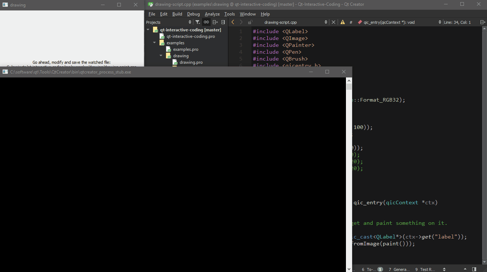

# Qt Interactive Coding

Author: [Martin Kutny](https://kutny.net/) \
License: MIT

## Summary

This library provides the ability to compile and execute C++ code from within
an application during runtime, defacto using C++ as a scripting language. This
library is implemented using Qt and therefore makes most sense integrating into
Qt projects.

Possible uses:

- interactive / creative / live coding
- application scripting
- hot reloading

**Requirements:** Qt 5, native compiler toolchain \
**Platforms:** Windows, Linux, possibly other platforms supported by Qt

## Demo



## Integration

You can either build the `qicruntime.pro` as a library and link to it, or add
it directly into your Qt project by including `qicruntime.pri`.

## Usage

Basic example of compiling and running C++ code at runtime.

``` c++
#include <qicruntime.h>

int main()
{
    qicRuntime rt;
    // configure your runtime build environment
    rt.setIncludePath({ "/path/to/src/qicruntime" });

    const char src[] = "#include <qicentry.h>\n"
                       "#include <stdio.h>\n"
                       "extern \"C\" QIC_DLL_EXPORT void qic_entry(qicContext *ctx) {\n"
                       "    printf("hello runtime!");\n"
                       "}\n";

    rt.exec(src);

    return 0;
}
```

## Interop

To interact and exchange data with the runtime-compiled code, use *context
variables*. An entire, complex application model can be shared with the runtime
code this way.

``` c++
class AppModel {
    // actually defined in a common header or library for both
    // the host application and the runtime-compiled code
};

int main()
{
    AppModel model;

    qicRuntime rt;
    rt.setCtxVar(&model, "model", nullptr);

    rt.exec(...);
}
```

Then, in the runtime code, access the *context variable* via the `qicContext`.

``` c++
#include <AppModel.h> // possibly also link AppModel.lib/.dll

extern "C" void qic_entry(qicContext *ctx)
{
    AppModel *const model = static_cast<AppModel*>(ctx->get("model"));
    model->... // access or modify data, call methods
}
```

For more examples, see the code in the [examples](src/examples/) directory.

## Design

The principle of this library is very simple, no magic, no special tricks. The
code is compiled into a shared library (.dll) and loaded during runtime. The
only requirement is that the library exports a well defined symbol `qic_entry`.
This is the entry point called by the runtime component.

``` c++
extern "C" void qic_runtime(qicContext *ctx);
```

A very simple interface is used to exchange `void*` pointers to arbitrary data
between the host application and the loaded library. This is most flexible, as
the user is free to use whatever techique to exchange data and interact with
the runtime-compiled code:

- pointers to POD structures,
- C function pointers, callbacks,
- virtual base interfaces,
- full C++ classes in common shared libraries.

To compile the runtime-compiled code, we make use of the Qt build system `qmake`
and leverage its natural cross-platform capability.

Here's what happens internally every time `rt.exec()` is called:

1. A Qt shared library project is generated in a temporary directory, using the
source code that was passed to `exec()`.
2. `qmake` is invoked to generate a `Makefile`.
3. `make` is invoked to build the library.
4. The generated shared library is loaded.
5. The symbol `qic_entry` is resolved and called.
6. The library remains loaded in the host process for the duration of the
`qicRuntime` object.
